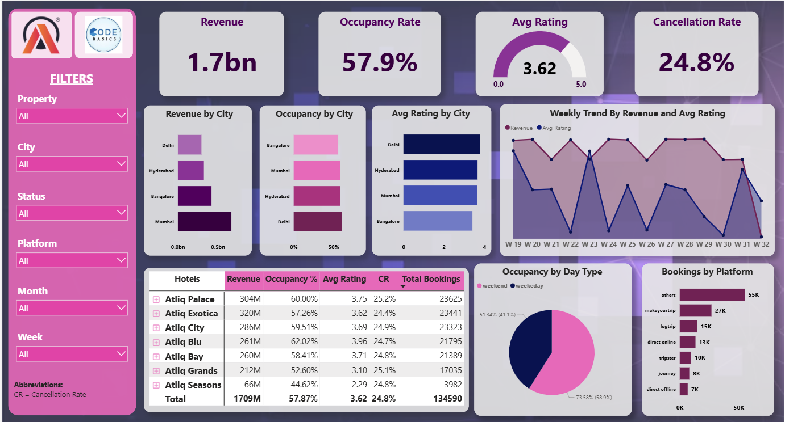

# 🏨 Hospitality Revenue Dashboard — Power BI

A business intelligence dashboard built as part of the 
AtliQ Technologies Data Analytics competition.

---

## 📌 Problem Statement

AtliQ Grands, a chain of luxury hotels across India, was 
experiencing declining revenue and market share. The goal 
was to analyze booking and performance data to uncover 
insights that could help the revenue management team make 
better decisions.

---

## 📊 Dashboard Overview

---

## 🔍 Key Metrics Tracked

- **Total Revenue** — ₹1.7 Billion
- **Occupancy Rate** — 57.9%
- **Average Rating** — 3.62 / 5.0
- **Cancellation Rate** — 24.8%

---

## 💡 Key Insights

- Mumbai generates the highest revenue but Delhi leads 
  in average customer ratings
- Atliq Blu has the best occupancy rate (62%) among 
  all properties
- Weekend occupancy (73.6%) significantly outperforms 
  weekday occupancy (51.3%)
- MakeYourTrip is the top booking platform with 27K bookings
- Atliq Seasons underperforms across all metrics — 
  lowest revenue, rating, and occupancy

---

## 🛠️ Tools Used

- Power BI (dashboard and visualizations)
- Microsoft Excel (data cleaning and validation)

---

## 📁 Files

| File | Description |
|------|-------------|
| `dashboard.png` | Final dashboard screenshot |
| `Hotel Analytics.pbix` | Power BI source file |

---

## 🏆 Context

This project was submitted as part of the **AtliQ 
Technologies Data Analytics Challenge** — a competition 
where participants were given a real hospitality dataset 
and asked to answer business questions through data 
visualization.
